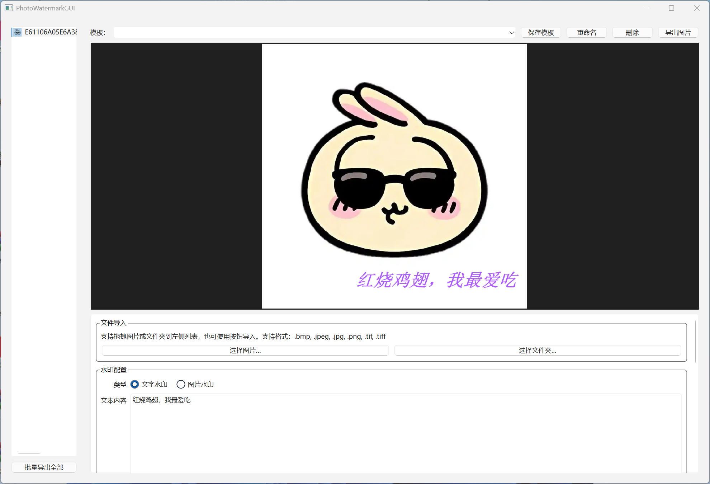
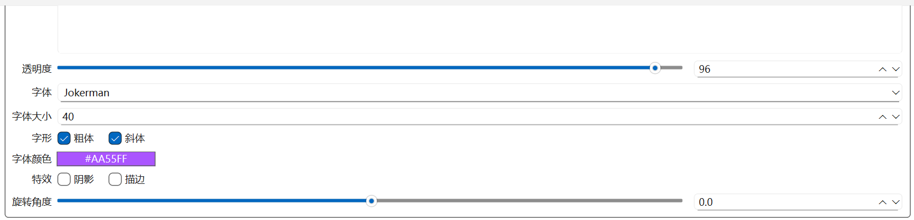
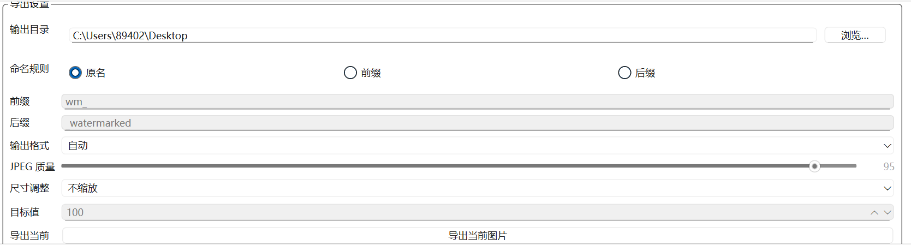

# PhotoWatermarkGUI

基于 **PyQt6** 与 **Pillow** 构建的桌面水印工具，支持单张/批量为图片添加文本或图片水印，并保持实时预览同步导出效果。

## ✨ 功能亮点

- 📥 **多种导入方式**：拖拽或选择图片/文件夹，缩略图列表与原图预览一目了然。
- 📝 **双水印模式**：文本与图片水印二选一，支持透明度、缩放、字体/字形/颜色、阴影、描边等样式调节。
- 🎯 **灵活定位**：九宫格快捷定位、拖拽位置、百分比坐标同步，支持 -360°~360° 旋转。
- 💾 **模板系统**：保存/加载水印与导出配置，自动恢复上次会话。
- 📤 **批量导出**：自定义输出目录、命名规则、格式（自动/JPEG/PNG）及尺寸缩放策略。
- 🪄 **实时预览**：Qt 绘制管线与导出逻辑一致，所见即所得。

## 🚀 快速开始

```powershell
# 1. 创建并激活虚拟环境（可选）
python -m venv .venv
.venv\Scripts\Activate.ps1

# 2. 安装依赖
pip install -r requirements.txt

# 3. 启动应用
python -m photowatermark_gui.main
```

> 提示：首次运行会在用户目录创建配置文件，记录模板与会话信息。

## 🧩 项目结构

```text
photowatermark_gui/
├── app.py               # 主窗口与 UI 交互逻辑
├── main.py              # 应用入口（兼容打包执行）
├── models.py            # 水印 & 导出数据模型
├── services/            # 图像加载、水印渲染、模板管理等服务
└── widgets/             # 预览、图片列表等自定义控件
```

## 🧱 开发笔记

- 默认依赖版本：`PyQt6>=6.6,<7.0`、`Pillow>=10.0,<11.0`。
- 如需调试 Pillow 与 Qt 的互操作，请参考 `services/watermark.py` 中的 `ImageQt.fromqimage` 使用方式。
- 运行 `python -m compileall photowatermark_gui` 可做快速语法校验。

## 📦 打包发布

生成便携式文件夹（包含依赖）：

```powershell
pyinstaller --noconfirm --windowed --name PhotoWatermarkGUI photowatermark_gui\main.py
```

若需单文件可执行程序（运行时会自解压到临时目录）：

```powershell
pyinstaller --noconfirm --windowed --onefile --name PhotoWatermarkGUI photowatermark_gui\main.py
```

打包完成后，可在 `dist/` 目录找到输出结果；`build/` 与 `.spec` 为中间文件，可按需添加到 `.gitignore`。

## ✅ 当前状态

- 文本/图片双模式水印 ✔️
- 风格控制（颜色、字体、粗斜体、阴影、描边）✔️
- 缩放、透明度、旋转、拖拽定位 ✔️
- 批量导出与模板系统 ✔️

## 🖼️ 界面速览

> 下方图片为占位示意，请将 `docs/images/*.png` 替换为实际截图。

| 模块 | 说明 | 预览 |
| --- | --- | --- |
| 主界面总览 | 图片列表、实时预览与水印配置面板的整体布局。 |  |
| 水印配置 | 文本/图片两种模式，以及颜色、透明度、旋转等细节调节。 |  |
| 批量导出设置 | 输出目录、命名规则、格式与尺寸调整选项集中展示。 |  |

感谢体验，如需二次开发或继续扩展欢迎提 Issue / PR！
